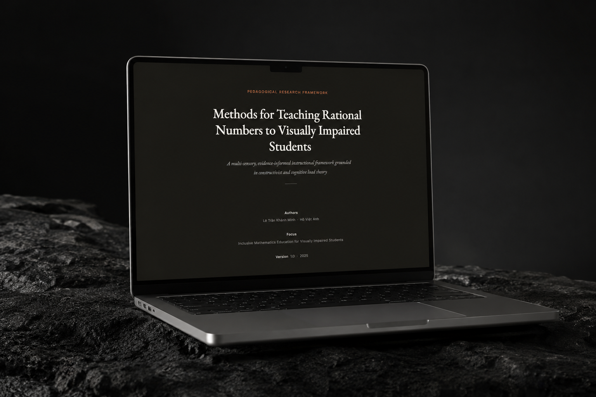

<div align="center">


# Mathematics Methodology on Education

### Unique Frameworks for Teaching Mathematics to Visually Impaired Children

<p>
  A GitHub-based research showcase of instructional frameworks designed to make mathematics
  more accessible through tactile learning, verbal explanation, guided reasoning, and structured independence.
</p>

<p>
  <a href="docs/ABSTRACT.md">Abstract</a>
  |
  <a href="docs/METHODOLOGY_OVERVIEW.md">Methodology Overview</a>
  |
  <a href="docs/REFERENCES.md">References</a>
  |
  <a href="src/index.html">Open Web Source</a>
</p>

<p>
  
  
  
  
  
  
</p>

<p>
  <a href="#preview"></a>
  <a href="#featured-frameworks"></a>
  <a href="#quick-start"></a>
  <a href="src/index.html"></a>
</p>

</div>

<table>
  <tr>
    <td width="50%" valign="top">
      <h3>Project Snapshot</h3>
      <p>A GitHub-based research showcase of instructional frameworks designed to make mathematics more accessible through tactile learning, verbal explanation, guided reasoning, and structured independence.</p>
    </td>
    <td width="50%" valign="top">
      <h3>Navigation</h3>
      <p>
        <a href="#featured-frameworks">Featured Frameworks</a><br />
        <a href="#framework-summary">Framework Summary</a><br />
        <a href="#real-use">Real Use</a><br />
        <a href="#project-leadership">Project Leadership</a><br />
        <a href="#why-it-matters">Why It Matters</a><br />
        <a href="#theoretical-grounding">Theoretical Grounding</a><br />
        <a href="#repository-structure">Repository Structure</a><br />
        <a href="#quick-start">Quick Start</a><br />
        <a href="#documentation">Documentation</a><br />
        <a href="#roadmap">Roadmap</a><br />
        <a href="#citation">Citation</a>
      </p>
    </td>
  </tr>
</table>

---

<a id="preview"></a>

## Preview

<div align="center">
  
</div>

<table>
  <tr>
    <td width="33%" align="center">
      <strong>6</strong>
      <br />
      featured teaching frameworks
    </td>
    <td width="33%" align="center">
      <strong>7</strong>
      <br />
      phases in the core instructional cycle
    </td>
    <td width="33%" align="center">
      <strong>1</strong>
      <br />
      central goal: accessible mathematical understanding
    </td>
  </tr>
</table>

<div align="center">

### [Featured Frameworks](#featured-frameworks) | [Framework Summary](#framework-summary) | [Real Use](#real-use) | [Project Leadership](#project-leadership) | [Why It Matters](#why-it-matters) | [Quick Start](#quick-start)

</div>

---

<a id="featured-frameworks"></a>

<details>
<summary><strong>Featured Frameworks</strong></summary>

<br />

## Featured Frameworks

This repository presents a set of distinct teaching frameworks created for mathematics instruction with visually impaired children. The emphasis is not only on accessibility, but on quality of understanding: how a learner forms a concept, explains it, tests it, and eventually owns it independently.

The collection is especially centered on rational numbers, where many students struggle when instruction is reduced to symbols without tactile or verbal grounding.

</details>

---

<a id="framework-summary"></a>

<details>
<summary><strong>Framework Summary</strong></summary>

<br />

## Framework Summary

| Code | Framework | Distinct contribution |
| --- | --- | --- |
| `MSCM` | Multi-Sensory Conceptualisation Method | Replaces visual-first instruction with touch, sound, and guided language to build concept formation |
| `SWEM` | Structured Worked Example Method | Uses explicit modelling to reduce overload and make mathematical procedure legible |
| `GIT` | Guided-to-Independent Transition | Structures the shift from instructor modelling to learner autonomy |
| `VCE` | Verbalisation and Cognitive Encoding | Turns spoken explanation into a tool for deep understanding and retention |
| `EBLM` | Error-Based Learning Method | Uses intentional mistakes to teach diagnosis, critique, and correction |
| `CM` | Contextualisation Method | Connects abstract mathematics to lived situations so meaning comes before memorisation |

### Core Instructional Cycle

<table>
  <tr>
    <td align="center"><strong>1</strong><br />Pre-Experience (Tactile)</td>
    <td align="center"><strong>2</strong><br />Verbal Description</td>
    <td align="center"><strong>3</strong><br />Generalisation</td>
    <td align="center"><strong>4</strong><br />Worked Example</td>
  </tr>
  <tr>
    <td align="center"><strong>5</strong><br />Guided Practice</td>
    <td align="center"><strong>6</strong><br />Student Explanation</td>
    <td align="center"><strong>7</strong><br />Multimedia Reinforcement</td>
    <td align="center"><a href="#why-it-matters">Why It Matters</a></td>
  </tr>
</table>

1. Pre-Experience (Tactile)
2. Verbal Description
3. Generalisation
4. Worked Example
5. Guided Practice
6. Student Explanation
7. Multimedia Reinforcement

> `Student Explanation` is the anchor phase because it exposes actual reasoning, not surface imitation.

</details>

---

<a id="real-use"></a>

<details>
<summary><strong>Real Use</strong></summary>

<br />

## Real Use

This framework has been used in real teaching work with visually impaired students in grades 7 and 8.

The score values in this section were derived from the parent survey used for the one-month evaluation process:

- [Google Forms survey](https://docs.google.com/forms/d/1J3JWsfPFdHRi28TigvbV4umkDpxewW5u5eS0VV7jRpU/edit?usp=forms_home&ouid=113644280705264055738&ths=true)

<table>
  <tr>
    <td width="100%" valign="top">
      <h3>Survey Preview</h3>
      <p><strong>Parent follow-up survey for one-month evaluation</strong></p>
      <p>This survey was used to collect before-and-after parent ratings and qualitative observations after the students joined the teaching program.</p>
      <p>
        
        
        
      </p>
      <p>
        <a href="https://docs.google.com/forms/d/1J3JWsfPFdHRi28TigvbV4umkDpxewW5u5eS0VV7jRpU/edit?usp=forms_home&ouid=113644280705264055738&ths=true">Open Survey</a>
      </p>
      <blockquote>
        <p>Rating areas used in the score table: knowledge uptake, confidence, concentration, initiative, and participation.</p>
      </blockquote>
    </td>
  </tr>
</table>

The one-month parent feedback recorded in `beforeandafter_1_month_metrics.xlsx` shows:

| Group | Real use evidence |
| --- | --- |
| Grade 8 | Scores moved from `3, 2, 2, 2, 3` before to `4, 5, 4, 5, 5` after one month across knowledge uptake, confidence, concentration, initiative, and participation |
| Grade 7 | One recorded case remained at `5, 5, 5, 5, 5` before and after one month, showing sustained strong performance; another moved from `2, 2, 3, 2, 3` to `3, 3, 3, 3, 4` |

Parent feedback in the same file also describes visible change in student behaviour and learning:

- “Con thích học hơn, và tự tìm hiểu thêm những gì liên quan đến buổi học, có trách nhiệm với nhiệm vụ được giao”
- “Con đã có sự tiến bộ rất tốt trong học tập và đa rất mạnh dạn trả lời các câu hỏi của các anh chị ạ”
- “Sau một tháng, Kiều Linh tiến bộ rõ rệt, tự tin khi giao tiếp trực tiếp và bằng điện thoại, Tiếng Anh tiến bộ hơn. Toán chưa chuyển biến rõ rệt.”

This section reflects actual classroom use rather than a purely theoretical framework.

</details>

---

<a id="project-leadership"></a>

<details>
<summary><strong>Project Leadership</strong></summary>

<br />

## Project Leadership

This repository also reflects project leadership, instructional coordination, and division of teaching responsibilities.

| Role | Contributor | Focus |
| --- | --- | --- |
| Project Lead | Ho Viet Anh | Overall direction, framework development, coordination, and instructional leadership |
| Framework Contributor | Le Tran Khanh Minh | Co-development of the mathematics teaching methodologies |
| English Instruction | Le Tran Khanh Chi | English teaching support within the broader educational effort |
| English Instruction | Ho Phuong Linh | English teaching support within the broader educational effort |

This makes the project legible not only as a set of ideas, but as a led educational initiative with clear ownership and team coordination.

</details>

---

<a id="why-it-matters"></a>

<details>
<summary><strong>Why It Matters</strong></summary>

<br />

## Why It Matters

<blockquote>
<p>Too many mathematics materials still assume that seeing is the main path to understanding. This project takes the opposite position: mathematical meaning can be constructed through non-visual pathways when instruction is deliberate, structured, and conceptually serious.</p>
</blockquote>

The frameworks in this repository emphasize:

- tactile experience before symbolic abstraction
- verbal reasoning as part of learning, not just assessment
- reduced cognitive overload during first contact with a new procedure
- movement from supported learning to independent explanation
- real-world contextualisation to deepen meaning

For visually impaired children, these shifts are not cosmetic. They change who gets to understand mathematics fully.

</details>

---

<a id="theoretical-grounding"></a>

<details>
<summary><strong>Theoretical Grounding</strong></summary>

<br />

## Theoretical Grounding

The instructional logic in this repository draws from:

- Constructivism
- Cognitive Load Theory
- Dual Coding Theory
- Gradual Release of Responsibility
- Elaborative Interrogation
- Situated Cognition

Full references are available in [docs/REFERENCES.md](docs/REFERENCES.md).

</details>

---

<a id="repository-structure"></a>

<details>
<summary><strong>Repository Structure</strong></summary>

<br />

## Repository Structure

```text
Mathematics-Methodology-on-Education/
|-- assets/
|   |-- framework-logo.svg
|   `-- framework-preview-macbook.png
|-- .github/
|   `-- workflows/
|       `-- static.yml
|-- docs/
|   |-- ABSTRACT.md
|   |-- METHODOLOGY_OVERVIEW.md
|   `-- REFERENCES.md
|-- src/
|   |-- index.html
|   |-- js/
|   |   `-- main.js
|   |-- sections/
|   |   |-- abstract.html
|   |   |-- cover.html
|   |   |-- cycle.html
|   |   |-- footer.html
|   |   |-- methods.html
|   |   `-- theory.html
|   `-- styles/
|       |-- base.css
|       |-- components.css
|       |-- layout.css
|       `-- sections.css
|-- LICENSE
`-- README.md
```

</details>

---

<a id="quick-start"></a>

<details>
<summary><strong>Quick Start</strong></summary>

<br />

## Quick Start

```bash
git clone https://github.com/gmtigrisva123/Mathematics-Methodology-on-Education.git
cd Mathematics-Methodology-on-Education
```

Open [src/index.html](src/index.html) in a modern browser.

No build step is required.

</details>

---

<a id="documentation"></a>

<details>
<summary><strong>Documentation</strong></summary>

<br />

## Documentation

<table>
  <tr>
    <td><a href="docs/ABSTRACT.md"><strong>docs/ABSTRACT.md</strong></a></td>
    <td>concise statement of the framework and its educational objective</td>
  </tr>
  <tr>
    <td><a href="docs/METHODOLOGY_OVERVIEW.md"><strong>docs/METHODOLOGY_OVERVIEW.md</strong></a></td>
    <td>quick-reference summary of all six frameworks and the seven-phase cycle</td>
  </tr>
  <tr>
    <td><a href="docs/REFERENCES.md"><strong>docs/REFERENCES.md</strong></a></td>
    <td>theoretical sources behind the instructional design</td>
  </tr>
  <tr>
    <td><a href="src/index.html"><strong>src/index.html</strong></a></td>
    <td>primary web presentation</td>
  </tr>
</table>

- [docs/ABSTRACT.md](docs/ABSTRACT.md): concise statement of the framework and its educational objective
- [docs/METHODOLOGY_OVERVIEW.md](docs/METHODOLOGY_OVERVIEW.md): quick-reference summary of all six frameworks and the seven-phase cycle
- [docs/REFERENCES.md](docs/REFERENCES.md): theoretical sources behind the instructional design
- [src/index.html](src/index.html): primary web presentation

</details>

---

<a id="roadmap"></a>

<details>
<summary><strong>Roadmap</strong></summary>

<br />

## Roadmap

- refine the web presentation further for GitHub Pages
- fix encoding consistency across repository documents
- add formal citation metadata with `CITATION.cff`
- expand educator-facing implementation notes
- extend classroom examples beyond rational numbers

</details>

---

<a id="citation"></a>

<details>
<summary><strong>Citation</strong></summary>

<br />

## Citation

```text
Minh, Le Tran Khanh, and Ho Viet Anh. Mathematics Methodology on Education:
Unique Frameworks for Teaching Mathematics to Visually Impaired Children.
GitHub repository, 2025.
```

</details>

<details>
<summary><strong>Authors</strong></summary>

<br />

## Authors

- Ho Viet Anh
- Le Tran Khanh Minh
- Le Tran Khanh Chi
- Ho Phuong Linh

</details>

<details>
<summary><strong>License</strong></summary>

<br />

## License

This repository is distributed under the terms stated in [LICENSE](LICENSE).

</details>
